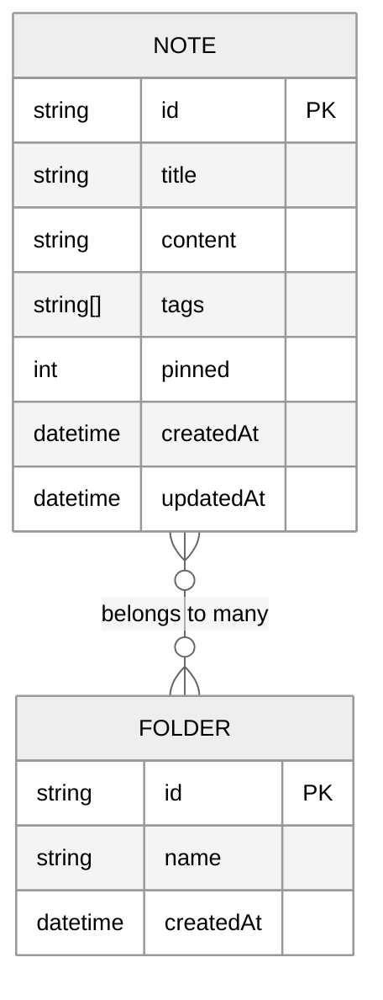
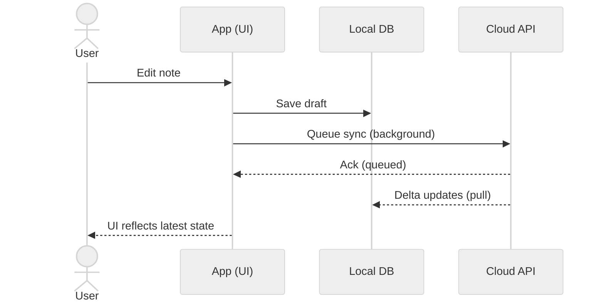

---
# Global deck settings
theme: default
title: "Notes App — Design & Implementation Overview"
info: |
  A concise, interactive Slidev presentation showcasing the features, UX design, and technical decisions behind a modern notes‑taking app.
  Includes interactive demos, code samples, and architecture diagrams.
class: text-left
mdc: true
transition: slide-left
fonts:
  sans: Inter, ui-sans-serif, system-ui, -apple-system, Segoe UI, Roboto, Helvetica Neue, Arial
  mono: ui-monospace, SFMono-Regular, Menlo, Monaco, Consolas, "Liberation Mono", "Courier New", monospace
css: |
  @import "./style.css";
highlighter: shiki
lineNumbers: true
drawings:
  persist: false
---

# Notes App
<div class="title-slide with-hero-glow">
  <div class="hero-copy">
    <h2 class="text-hero">Design • Features • Implementation</h2>
    <p class="subtitle text-md">A modern, minimal, and responsive notes experience</p>
    <div class="subtitle text-xs">Presenter: You • Date</div>
    <div class="hero-ctas mt-2">
      <a class="btn-primary" href="#agenda">View Agenda</a>
      <a class="btn-secondary" href="https://sli.dev" target="_blank" rel="noreferrer">About Slidev</a>
    </div>
  </div>
</div>

---

# Agenda {#agenda}

<div class="card-grid three mt-2">
  <div class="feature-card">
    <div class="eyebrow">01</div>
    <h3 class="feature-title">Product Overview</h3>
    <ul class="points-clean">
      <li>Problem & goals</li>
      <li>Personas & scenarios</li>
      <li>Feature tour</li>
    </ul>
  </div>
  <div class="feature-card">
    <div class="eyebrow">02</div>
    <h3 class="feature-title">Design System</h3>
    <ul class="points-clean">
      <li>IA & navigation</li>
      <li>UI building blocks</li>
      <li>Light theme defaults</li>
    </ul>
  </div>
  <div class="feature-card">
    <div class="eyebrow">03</div>
    <h3 class="feature-title">Implementation</h3>
    <ul class="points-clean">
      <li>Architecture</li>
      <li>Data model</li>
      <li>APIs & sync</li>
    </ul>
  </div>
</div>

---

# Layout concept

<div class="split-cols mt-2">
  <div class="left">
    <div class="feature-card">
      <div class="eyebrow">Navigation</div>
      <h3 class="feature-title">Sidebar + Content</h3>
      <ul class="points-clean">
        <li>Persistent sidebar for quick context switching</li>
        <li>Main canvas for note reading & editing</li>
        <li>Keyboard-first workflow</li>
      </ul>
    </div>
    <div class="feature-card">
      <div class="eyebrow">Theme</div>
      <h3 class="feature-title">Light by default</h3>
      <ul class="points-clean">
        <li>High contrast, low chrome</li>
        <li>Color accents for affordances</li>
        <li>System preference toggle</li>
      </ul>
    </div>
  </div>
  <div class="right">
    <div class="glass-frame tall">
      <div class="placeholder">Mock: Sidebar (folders, tags) • Main editor (title, markdown, toolbar)</div>
    </div>
  </div>
</div>

---

# Feature highlights

<div class="card-grid three mt-2">
  <div class="feature-card">
    <div class="eyebrow">Capture</div>
    <h3 class="feature-title">Quick Add</h3>
    <p class="muted">Hotkeys, templates, and Markdown support</p>
  </div>
  <div class="feature-card">
    <div class="eyebrow">Organize</div>
    <h3 class="feature-title">Folders & Tags</h3>
    <p class="muted">Hierarchies, filters, and saved views</p>
  </div>
  <div class="feature-card">
    <div class="eyebrow">Search</div>
    <h3 class="feature-title">Instant Search</h3>
    <p class="muted">Full‑text search with highlighting</p>
  </div>
  <div class="feature-card">
    <div class="eyebrow">Sync</div>
    <h3 class="feature-title">Offline-first</h3>
    <p class="muted">Local cache with background sync</p>
  </div>
  <div class="feature-card">
    <div class="eyebrow">Security</div>
    <h3 class="feature-title">End‑to‑end</h3>
    <p class="muted">At-rest encryption with key escrow options</p>
  </div>
  <div class="feature-card">
    <div class="eyebrow">Collab</div>
    <h3 class="feature-title">Share & Comment</h3>
    <p class="muted">Links, permissions, and inline comments</p>
  </div>
</div>

---

# Interactive demo: counter component

Use the +/− buttons to interact.

<Counter :count="2" />

<div class="section-divider"></div>

Code excerpt:

```ts {all|1-6|7-17}
<script setup lang="ts">
import { ref } from 'vue'

const props = defineProps({ count: { default: 0 } })
const counter = ref(props.count)
</script>

<template>
  <div class="card" style="width: fit-content">
    <button class="btn-secondary" @click="counter--">−</button>
    <span style="padding: 0 12px">{{ counter }}</span>
    <button class="btn-primary" @click="counter++">+</button>
  </div>
</template>
```

---

# Data model



---

# API design

```http
GET /api/notes?query=term&page=1&limit=20
200 OK
Content-Type: application/json

{
  "items": [
    { "id": "n_123", "title": "Daily plan", "excerpt": "..." }
  ],
  "page": 1,
  "hasMore": true
}
```

```http
POST /api/notes
Content-Type: application/json

{ "title": "New Note", "content": "# Hello", "tags": ["inbox"] }
```

---

# Sync strategy

<div class="split-cols mt-2">
  <div class="left">
    <div class="feature-card">
      <div class="eyebrow">Approach</div>
      <h3 class="feature-title">Offline-first</h3>
      <ul class="points-clean">
        <li>Local IndexedDB cache</li>
        <li>Background sync with queues</li>
        <li>Conflict resolution via vector clocks</li>
      </ul>
    </div>
    <div class="feature-card">
      <div class="eyebrow">Conflicts</div>
      <h3 class="feature-title">Last-writer-wins (default)</h3>
      <ul class="points-clean">
        <li>Manual merge option for rich text</li>
        <li>Change history retained per note</li>
      </ul>
    </div>
  </div>
  <div class="right">

  </div>
</div>

---

# Storage choices

- Local: IndexedDB (via Dexie) for structured notes and metadata
- Remote: PostgreSQL for durability, JSONB for tags
- Media: Object storage (S3 compatible), lazy loaded
- Search: SQLite FTS or external (Meilisearch) depending on scale

```sql
-- PostgreSQL table (simplified)
CREATE TABLE notes (
  id        TEXT PRIMARY KEY,
  title     TEXT NOT NULL,
  content   TEXT NOT NULL,
  tags      TEXT[] DEFAULT '{}',
  pinned    BOOLEAN DEFAULT false,
  created_at TIMESTAMPTZ DEFAULT now(),
  updated_at TIMESTAMPTZ DEFAULT now()
);
```

---

# Client code structure

```bash
src/
├─ app/
│  ├─ store.ts         # Pinia/Vuex-lite store
│  ├─ routes.ts        # Route definitions
│  └─ theme.ts         # Theme toggler (light default)
├─ components/
│  ├─ NoteList.vue
│  ├─ NoteEditor.vue
│  └─ TagChips.vue
├─ services/
│  ├─ api.ts           # HTTP client
│  └─ sync.ts          # sync queue + conflict policy
└─ utils/
   └─ debounce.ts
```

---

# Example: store and actions

```ts
// store.ts
import { ref, computed } from 'vue'

type Note = {
  id: string; title: string; content: string; tags: string[]; pinned?: boolean;
  createdAt: string; updatedAt: string;
}

const notes = ref<Note[]>([])

export const useNotes = () => {
  // PUBLIC_INTERFACE
  function createNote(data: Partial<Note>) {
    /** Create a note locally and enqueue sync. */
    const now = new Date().toISOString()
    const note: Note = {
      id: crypto.randomUUID(),
      title: data.title ?? 'Untitled',
      content: data.content ?? '',
      tags: data.tags ?? [],
      pinned: !!data.pinned,
      createdAt: now,
      updatedAt: now,
    }
    notes.value.unshift(note)
    // enqueueSync('create', note)
    return note
  }

  const count = computed(() => notes.value.length)
  return { notes, count, createNote }
}
```

---

# Search UX

<div class="card-grid two mt-2">
  <div class="feature-card">
    <div class="eyebrow">Principles</div>
    <ul class="points-clean">
      <li>Zero-result guidance (did‑you‑mean)</li>
      <li>Prefix and fuzzy match</li>
      <li>Keyboard nav and previews</li>
    </ul>
  </div>
  <div class="feature-card">
    <div class="eyebrow">Index</div>
    <ul class="points-clean">
      <li>Title, tags, and headings weighted higher</li>
      <li>Snippet generation in results</li>
      <li>Debounced 200ms queries</li>
    </ul>
  </div>
</div>

---

# Security model

- At-rest encryption using per-user keys
- Optional passphrase-derived key for private notebooks
- Share links use scoped tokens with expiration
- Audit logs for enterprise workspaces

```ts
// PUBLIC_INTERFACE
export async function encryptNote(content: string, key: CryptoKey) {
  /** AES-GCM encrypt note content; returns base64 ciphertext. */
  const enc = new TextEncoder().encode(content)
  const iv = crypto.getRandomValues(new Uint8Array(12))
  const buf = await crypto.subtle.encrypt({ name: 'AES-GCM', iv }, key, enc)
  const out = new Uint8Array(iv.byteLength + buf.byteLength)
  out.set(iv, 0); out.set(new Uint8Array(buf), iv.byteLength)
  return btoa(String.fromCharCode(...out))
}
```

---

# Accessibility and performance

- WCAG AA contrast, focus rings, skip links
- Reduced motion preference respected
- Lazy loading of media; code-splitting routes
- 60 FPS editor interactions with virtualization

---

# Live coding: generate placeholders

Use imported utility from snippets/external.ts.

```ts {all|1-5}
import { emptyArray } from '../snippets/external'

// PUBLIC_INTERFACE
export function placeholders(n: number) {
  /** Returns n empty items for skeleton UIs. */
  return emptyArray<string>(n)
}
```

---

# Theming options

<div class="card-grid three mt-2">
  <div class="feature-card">
    <div class="eyebrow">Light</div>
    <h3 class="feature-title">Default</h3>
    <p class="muted">High legibility, calm palette</p>
  </div>
  <div class="feature-card">
    <div class="eyebrow">Dark</div>
    <h3 class="feature-title">Optional</h3>
    <p class="muted">OLED‑friendly, reduced glare</p>
  </div>
  <div class="feature-card">
    <div class="eyebrow">High Contrast</div>
    <h3 class="feature-title">A11y</h3>
    <p class="muted">Elevated contrast & clear focus</p>
  </div>
</div>

---

# Roadmap

<div class="timeline horiz mt-2">
  <div class="time-node">
    <div class="time-dot"></div>
    <div class="time-card">
      <div class="eyebrow">Q1</div>
      <strong>Core editor</strong><br>
      Templates, tags, search
    </div>
  </div>
  <div class="time-node">
    <div class="time-dot"></div>
    <div class="time-card">
      <div class="eyebrow">Q2</div>
      <strong>Sync & share</strong><br>
      Collaboration & comments
    </div>
  </div>
  <div class="time-node">
    <div class="time-dot future"></div>
    <div class="time-card">
      <div class="eyebrow">Q3</div>
      <strong>AI features</strong><br>
      Summaries, tagging, search boosters
    </div>
  </div>
</div>

---

# Summary

- Minimal, responsive UI with sidebar navigation
- Offline-first architecture with robust sync
- Secure by default; share with control
- Clear roadmap toward collaboration and AI

---

layout: center
class: text-center
---

# Thank you

Press S for presenter mode • E to edit • Arrow keys to navigate
